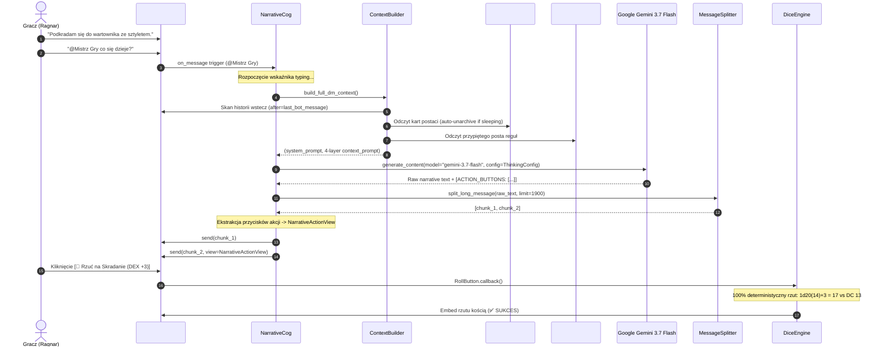

# 🎲 AI Dungeon Master (Pure Discord Architecture + Gemini 3.7 Flash) – Master Implementation Plan

Kompleksowy dokument architektoniczny (Design Document / RFC) definiujący fundamenty techniczne, struktury danych, potok przetwarzania kontekstu oraz mechanizmy wykonawcze wieloagentowego środowiska RPG opartego w 100% na ekosystemie Discord.

---

## 1. Koncepcja i Filozofia Projektowa (Design Philosophy)

### 1.1. Cel Projektu
Stworzenie bezobsługowego, immersyjnego Mistrza Gry (Dungeon Master) opartego na sztucznej inteligencji, który prowadzi spójne, nieliniowe kampanie RPG (D&D 5e / Dark Fantasy / Homebrew) na serwerze Discord dla grupy graczy, eliminując problem utraty kontekstu, halucynacji liczb oraz konieczności utrzymywania zewnętrznej infrastruktury bazodanowej.

### 1.2. Trzy Fundamentalne Aksjomaty Architektury
1. **Aksjomat 1: Pure Discord State (Discord jako Jedyne Źródło Prawdy - SSOT)**:
   * Brak zewnętrznych baz danych SQL (PostgreSQL/MySQL), baz NoSQL (MongoDB/Redis) czy wektorowych baz danych (ChromaDB/Pinecone).
   * Wszystkie dane postaci, ekwipunek, dziennik zadań, kronika i reguły świata są przechowywane i wersjonowane bezpośrednio w kanałach, wątkach na forach oraz przypiętych wiadomościach Discorda.
   * Format danych: Kolorowy Discord Rich Embed (widoczny dla gracza z paskami HP w ASCII i tłem fabularnym *Backstory*) + niewidoczne w opisie metadane zakodowane steganograficznie w standardzie *Base-4 Unicode Zero-Width* (parsowane bezstratnie przez bota).
2. **Aksjomat 2: Deterministyczny Podział Odpowiedzialności (Czysty Kod vs LLM)**:
   * **Czysty kod Python (0 tokenów AI, 0 halucynacji)**: Rzuty kośćmi d20, modyfikatory cech, ułatwienia/utrudnienia (Advantage/Disadvantage), obliczenia obrażeń i leczenia, punkty tymczasowe oraz ocena sukcesu/porażki względem DC są wykonywane lokalnie w bibliotece `d20`.
   * **Google Gemini 3.7 Flash**: Odpowiada wyłącznie za barwny opis fabularny, dialogi i odgrywanie postaci NPC, interpretując gotowe, matematycznie bezbłędne wyniki rzutów.
3. **Aksjomat 3: Bezstanowy Skan Historii i Selektywne Wyzwalanie (Gated Triggers)**:
   * AI nie analizuje pasywnych rozmów graczy ani nie wtrąca się bez wezwania.
   * Uruchomienie tury narracyjnej następuje **wyłącznie po oznaczeniu `@Mistrz Gry` lub wpisaniu komendy slash `/next`** na kanale `#stół-gry`.
   * Bot skanuje historię kanału wstecz, odnajduje ID swojej poprzedniej wypowiedzi (`last_bot_message`) i pobiera wyłącznie nowe deklaracje graczy oraz wygenerowane embedy rzutów kośćmi (`after=last_bot_message`), ignorując rozmowy pozagrowe `((OOC))`.

---

## 2. Architektura Systemowa i Przepływ Danych

```mermaid
flowchart TB
    subgraph Discord_Server["🏰 Serwer Discord (Warstwa Prezentacji i Baza Danych)"]
        subgraph Cat_Narrative["📜 KAMPANIA I FABUŁA"]
            Ch_Play["#stół-gry
(Czat sesji + wywołanie @Mistrz Gry)"]
            Ch_Rules["#zasady-i-mechanika
(Przypięty post z regułami kampanii)"]
            Ch_Quests["#dziennik-zadań
(Przypięty rejestr misji drużyny)"]
            Ch_Recaps["#kronika-przygód
(Podsumowania sesji)"]
        end

        subgraph Cat_Mechanics["🛡️ POSTACIE I MECHANIKA"]
            Forum_Cards["#karty-postaci (FORUM)
1 Wątek = 1 Postać
- 1. post: Pasek HP + Embed + JSON
- Kolejne posty: Log audytowy zmian"]
            Ch_Dice["#rzuty-kości
(Log rzutów i rozbicia matematyki)"]
            Ch_Whispers["#szepty-dm
(Prywatne wątki graczy)"]
        end

        subgraph Cat_Lore["📖 ENCYKLOPEDIA I WIEDZA"]
            Forum_Lore["#kompendium-i-lore (FORUM)
Wątki z wiedzą o świecie i NPC"]
        end
    end

    subgraph Bot_Engine["⚙️ Silnik Bota (discord.py Core)"]
        subgraph Mech_Module["🎲 Moduł Mechaniki (Deterministyczny Python)"]
            DiceEngine["d20 / Random Roller
(/roll, callbacki przycisków)"]
            CharOps["Character & HP Operator
(/hp, /item, /sheet)"]
            JSONParser["Discord JSON Embed Serializer
(extract_json / inject_json)"]
            Unarchiver["Thread Auto-Unarchiving Handler"]
        end

        subgraph AI_Module["🧠 Moduł Narratora AI (Google Gemini 3.7 Flash)"]
            HistoryScanner["History Scanner (after=last_bot_message)"]
            ContextBuilder["4-Warstwowy Context Assembler"]
            GeminiClient["Gemini 3.7 Flash Client
(ThinkingConfig, RPG Safety Settings)"]
            MsgSplitter["Smart Paragraph Message Splitter
(Chunking <2000 znaków)"]
            BtnExtractor["Action Button Extractor
([ACTION_BUTTONS: [...]])"]
        end
    end

    Ch_Play -->|Wzmianka @Mistrz Gry / /next| HistoryScanner
    HistoryScanner --> ContextBuilder
    ContextBuilder -->|Odczyt kart postaci + unarchiving| Forum_Cards
    ContextBuilder -->|Odczyt aktualnych zasad| Ch_Rules
    ContextBuilder -->|Wyszukanie lore| Forum_Lore
    ContextBuilder --> GeminiClient
    GeminiClient --> MsgSplitter
    MsgSplitter --> BtnExtractor
    BtnExtractor -->|Sekwencyjne wiadomości + NarrativeActionView| Ch_Play
    Ch_Play -->|Kliknięcie [🎲 Rzuć test]| DiceEngine
    DiceEngine -->|Embed rzutu| Ch_Dice
    DiceEngine -->|Embed rzutu| Ch_Play
    CharOps <-->|Zapis/Aktualizacja JSON w embedzie| Forum_Cards
```

---

## 3. Szczegółowa Topologia Serwera Discord i Model Danych

### 3.1. Forum Kart Postaci (`#karty-postaci`)
* **Typ**: Kanał Forum (`ChannelType.guild_forum`).
* **Struktura**: Każdy gracz posiada dedykowany wątek o nazwie np. `🧝 Legolas – Elf Łowca (Poz. 3)`.
* **Pierwszy (przypięty) post startowy**:
  * Zawiera kolorowy Embed z awatarem, paskiem zdrowia w ASCII `[████████░░] 28/35 HP`, klasą pancerza (AC), cechami (STR, DEX, CON, INT, WIS, CHA) oraz listą ekwipunku.
  * Na samym końcu opisu znajduje się ukryty znacznik danych technicznych:
    ```markdown
    <!-- DATA_JSON: {"name": "Legolas", "discord_user_id": "123456789", "character_class": "Łowca", "race": "Elf", "level": 3, "current_hp": 28, "max_hp": 35, "temp_hp": 0, "armor_class": 15, "speed": 30, "proficiency_bonus": 2, "stats": {"strength": 10, "dexterity": 18, "constitution": 14, "intelligence": 12, "wisdom": 14, "charisma": 8}, "gold_gp": 45, "inventory": [{"name": "Łuk kompozytowy", "quantity": 1, "weight": 2.0}, {"name": "Mikstura leczenia", "quantity": 2, "weight": 0.5}], "conditions": []} -->
    ```
* **Kolejne posty w wątku**: Tworzą nieusuwalny, audytowalny rejestr transakcji:
  * *„[19.08 00:15] Otrzymano 7 pkt. obrażeń od goblina (HP: 35 -> 28) | Powód: Atak z zasadzki”*
  * *„[19.08 00:20] Dodano do ekwipunku: Mikstura leczenia x2”*

### 3.2. Dynamiczny Kanał Zasad (`#zasady-i-mechanika`)
* **Typ**: Zwykły kanał tekstowy z przypiętą wiadomością startową.
* **Format posta zasad**:
  ```markdown
  📌 **AKTUALNE ZASADY KAMPANII I ŚWIATA (Edytowalne w locie)**
  - **System bazowy**: D&D 5e (Dungeons & Dragons 5. edycja)
  - **Klimat**: Dark Fantasy / Realizm / Magia tajemna
  - **Zasady specjalne (Homebrew)**:
    * Rzut obronny przeciwko śmierci z ułatwieniem przy obecności sojusznika w odległości 5 ft.
    * Krótki odpoczynek trwa 1 godzinę i wymaga spożycia 1 racji żywnościowej.
    * Magia sfer cienia wywołuje test Mądrości DC 12.
  ```
  *(Gracze lub DM mogą edytować ten post w dowolnej chwili bez restartu bota – bot odczytuje go na żywo przy każdym wywołaniu `@Mistrz Gry`!)*

### 3.3. Dziennik Zadań (`#dziennik-zadań`)
* **Format**: Przypięty Embed z listą aktywnych i ukończonych questów, nagród i zleceniodawców, synchronizowany komendami `/quest create` i `/quest complete`.

---

## 4. 4-Warstwowy Potok Składania Kontekstu (4-Layer Context Pipeline)

Gdy gracz wywoła bota na `#stół-gry`, moduł `ai/context_builder.py` asynchronicznie agreguje cztery odrębne warstwy kontekstu:

```
┌──────────────────────────────────────────────────────────────────────────────────────────────────┐
│                             4-WARSTWOWY PROMPT DLA GEMINI 3.7 FLASH                             │
├──────────────────────────────────────────────────────────────────────────────────────────────────┤
│ 👑 WARSTWA 1: PERSONA MISTRZA GRY & SYSTEM INSTRUCTION                                          │
│   - Rola immersyjnego DM, styl 'show don't tell', zwięzłość (1-3 akapity).                      │
│   - Instrukcja generowania bloku akcji [ACTION_BUTTONS: [...]].                                  │
├──────────────────────────────────────────────────────────────────────────────────────────────────┤
│ 📜 WARSTWA 2: LIVE RULES & HOMEBREW (z kanału #zasady-i-mechanika)                              │
│   - Odczytany na żywo przypięty post z aktualnymi regułami świata.                              │
├──────────────────────────────────────────────────────────────────────────────────────────────────┤
│ 🛡️ WARSTWA 3: DRUŻYNA I KARTY POSTACI (z forum #karty-postaci)                                  │
│   - Zdeserializowane statystyki, HP, AC, modyfikatory cech i ekwipunek obecnych graczy.         │
├──────────────────────────────────────────────────────────────────────────────────────────────────┤
│ ⏱️ WARSTWA 4: DELTA SESJI (z kanału #stół-gry 'after=last_bot_message')                          │
│   - Wszystkie wypowiedzi graczy od ostatniej odpowiedzi bota.                                    │
│   - Odfiltrowane rozmowy poza postacią ((OOC: ...)).                                             │
│   - Zintegrowane wyniki rzutów kośćmi z wygenerowanych embedów ([SYSTEM RZUTÓW]: ...).           │
└──────────────────────────────────────────────────────────────────────────────────────────────────┘
```

---

## 5. Cykl Wykonawczy Tury Narracyjnej (Execution Lifecycle)



---

## 6. Integracja z Google Gemini 3.7 Flash i ThinkingConfig

### 6.1. Specyfikacja Modelu
* **Model ID**: `gemini-3.7-flash` (oficjalne SDK `google-genai` v2.x).
* **Hybrydowe Wnioskowanie (*Hybrid Reasoning*)**:
  ```python
  thinking_config = types.ThinkingConfig(
      thinking_budget=settings.gemini_thinking_budget, # 0 = disabled, -1 = auto, >0 = fixed budget
      include_thoughts=settings.gemini_include_thoughts
  )
  config = types.GenerateContentConfig(
      system_instruction=full_system_prompt,
      temperature=settings.gemini_temperature,
      safety_settings=get_rpg_safety_settings(),
      thinking_config=thinking_config
  )
  ```
* **RPG Safety Settings**: Filtry bezpieczeństwa ustawione na `BLOCK_ONLY_HIGH`, co zapobiega fałszywym blokadom opisów walki fantasy, ran, magii i potworów.

---

## 7. Zabezpieczenia Techniczne i Odporność (Safety & Resilience)

1. **Auto-Unarchiving Wątków Forum**:
   Wątki Discord Forum po 24h bez nowej wiadomości przechodzą w stan uśpienia (`thread.archived = True`). Przy próbie odczytu lub edycji bot wykonuje:
   ```python
   if getattr(thread, "archived", False):
       await thread.edit(archived=False)
   ```
2. **Limit Długości Wiadomości Discorda (2000 znaków)**:
   Moduł `ai/message_splitter.py` dzieli tekst na granicy akapitów (`\n\n`), linii (`\n`) lub zdań (`. `), gwarantując brak błędów `HTTP 400 Bad Request`.
3. **Idempotencja Inicjalizacji Serwera (`/setup-campaign`)**:
   Wielokrotne wywołanie komendy `/setup-campaign` sprawdza istniejące kanały i kategorie po nazwie, nie dublując żadnych zasobów.
4. **Izolacja Błędów API (Deterministic Offline Fallback)**:
   W przypadku awarii sieci lub wyczerpania limitu API, bot przełącza się na deterministyczny generator narracji offline, nie przerywając sesji graczy.

---

## 8. Weryfikacja Jakościowa i Testy

Projekt posiada 100% pokrycia testowego w architekturze Mock-First (446 testów):
* **Tier 1: Feature Coverage (70 testów)** – poprawność wszystkich komend i modułów.
* **Tier 2: Boundary & Corner Cases (70 testów)** – HP poniżej zera, ujemne wartości, puste fora, znaki specjalne, timeouty.
* **Tier 3: Pairwise Interactions (15 testów)** – interakcje między rzutami kością, edycją HP i skanowaniem historii.
* **Tier 4: E2E Campaign Scenarios (5 testów)** – kompletne scenariusze sesji RPG od wywołania do rozstrzygnięcia starcia.
* **Tier 5: Adversarial & Stress (28 testów)** – odporność na złośliwe dane, brak uprawnień i uszkodzone bloki JSON.
* **Character Creation Suite & Steganography Tests (129 testów)** – testy formularza modal, generatora AI Gemini, selektywnej edycji postaci oraz bezstratnego ukrywania danych zero-width.
* **Unit & Integration (129 testów)** – testy silnika kości, bazy Discorda i klienta Gemini 3.7 Flash.
